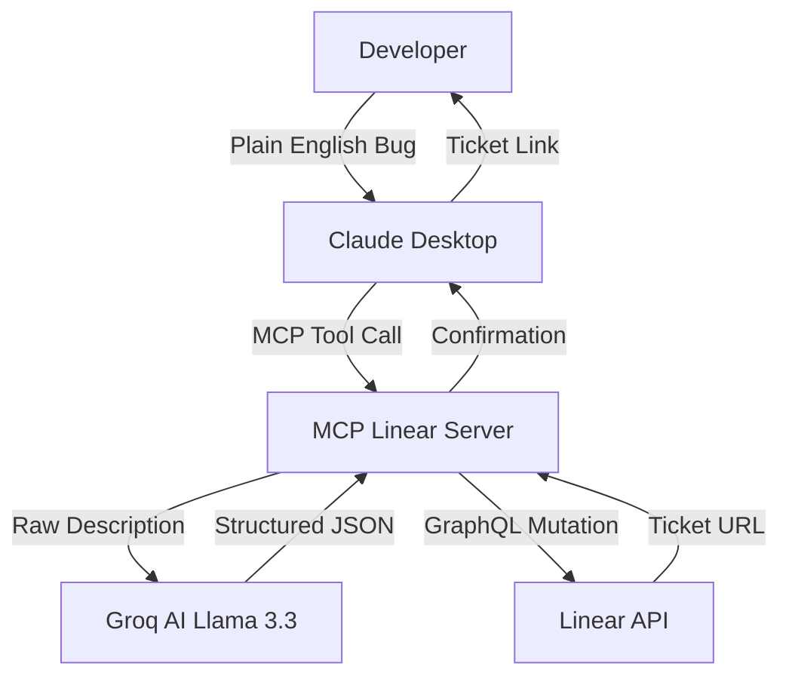

# Linear Ticket MCP Server

A Model Context Protocol (MCP) server that transforms plain English descriptions into properly structured Linear tickets using Groq AI.

## Workflow



## Features

- **Plain English to Ticket**: Describe a bug or task naturally, and let AI structure it (Title, Description, Steps, Priority).
- **Team Discovery**: List available teams to ensure tickets land in the right place.
- **Ticket Lookup**: Quickly fetch ticket details by ID.

## Prerequisites

- [Linear Account](https://linear.app/) & [Personal API Key](https://linear.app/settings/account/security)
- [Groq API Key](https://console.groq.com/keys) (Free tier available)
- [uv](https://github.com/astral-sh/uv) for dependency management

## Installation

1. Clone the repository (or copy the `mcp-linear-tickets` package).
2. Create a `.env` file in the package root:

```env
LINEAR_API_KEY=your_linear_api_key
GROQ_API_KEY=your_groq_api_key
LINEAR_TEAM_ID=your_default_team_id (Use list_teams to find this)
```

## Usage

### Connecting to Claude Desktop

Add the following to your `claude_desktop_config.json`:

```json
{
  "mcpServers": {
    "linear": {
      "command": "uv",
      "args": [
        "--directory",
        "/absolute/path/to/utils/packages/mcp-linear-tickets",
        "run",
        "src/mcp_linear_tickets/main.py"
      ]
    }
  }
}
```

### Manual Terminal Testing

To verify the server is working without using Claude, run this command from the **root directory** of the workspace:

```bash
(printf '{"jsonrpc":"2.0","method":"initialize","params":{"protocolVersion":"2024-11-05","capabilities":{},"clientInfo":{"name":"test","version":"1.0"}},"id":1}\n{"jsonrpc":"2.0","method":"notifications/initialized"}\n{"jsonrpc":"2.0","method":"tools/call","params":{"name":"create_ticket","arguments":{"description":"a new bug in aws bedrock found while waiting for response. Instead of obtaining timeout, the system keeps trying to connect"}},"id":2}\n'; cat) | uv run src/mcp_linear_tickets/main.py
```
*Note: Press `Ctrl+C` to exit after receiving the response.*

## Tools Provided

- `list_teams`: Returns available Linear teams and their IDs.
- `create_ticket(description: str, team_id: str = None)`: Creates a ticket from natural language.
- `get_ticket(issue_id: str)`: Fetches ticket details by identifier (e.g., LIN-42).

## Testing

Run the automated test suite (including network-level integration tests):

```bash
cd packages/mcp-linear-tickets
uv run pytest
```

## License

MIT
