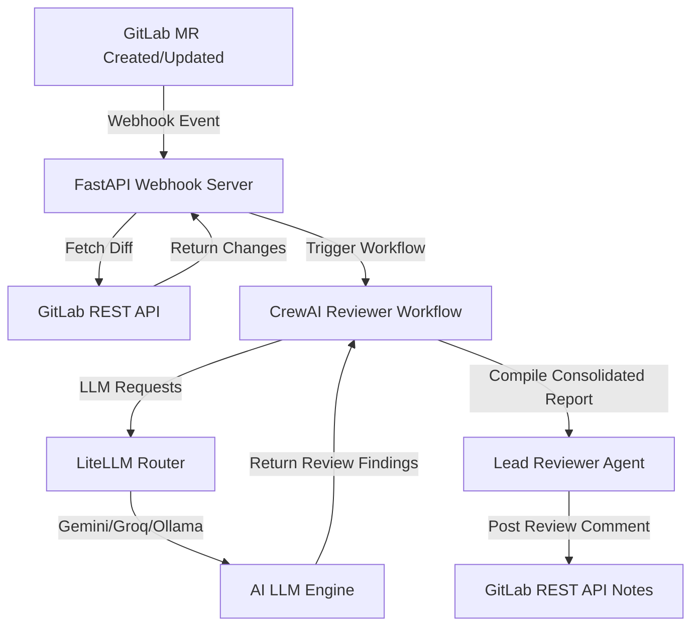

# AI Pull Request Reviewer

An automated code reviewer powered by **CrewAI** and LLM backends (like Google Gemini, Groq, or local Ollama). It analyzes GitLab Merge Requests across four key dimensions (Security, Architecture, Code Quality, and Documentation) and automatically publishes consolidated feedback grouped by severity directly into the Merge Request comments.

---

## Features
- **Multi-Dimensional Review**: Analyzes pull requests for:
  - **Security**: Exposed secrets, SQL/shell injections, weak cryptography, insecure dependencies.
  - **Architecture**: Decoupling, layering violations (e.g. database logic in controllers), circular imports.
  - **Code Quality**: Cognitive complexity, long methods, duplicate code, style violations, refactoring candidates.
  - **Documentation**: Missing PEP-257 docstrings on public APIs, missing README/CHANGELOG updates.
- **Lead Reviewer Consolidation**: Synthesizes individual reviewer reports into a single, non-redundant markdown comment.
- **Severity Classification**: Groups findings into `Critical`, `Major`, `Minor`, and `Suggestions`.
- **GitLab Webhook & API Integration**: Listens for merge request events, fetches diffs via GitLab REST API, and posts consolidated comments back to the MR.
- **Optimized & Flexible Workflows**:
  - **Optimized Mode (1 LLM Call)**: Reviews and consolidates in a single LLM execution to save tokens and avoid daily API rate limits.
  - **Sequential Mode (5 LLM Calls)**: Runs four specialized reviewer agents independently, then executes the Lead Reviewer to compile results.
- **Broad LLM Support**: Integrates with Google Gemini, Groq, local Ollama, and other providers via LiteLLM.

---

## Architecture

The system is structured as an event-driven review orchestrator:



---

## Installation & Setup

This package is managed as part of a `uv` workspace.

### 1. Install Dependencies
From the workspace root directory:
```bash
uv sync
```

### 2. Configure Environment Variables
Copy `.env.example` to `.env` in the package directory (`packages/pr-reviewer/.env`) and fill in the values:
```bash
# Google Gemini configuration (Recommended)
GOOGLE_API_KEY="your-gemini-api-key"
LLM_MODEL="gemini/gemini-1.5-flash"

# OR Groq configuration
# GROQ_API_KEY="your-groq-api-key"
# LLM_MODEL="groq/llama-3.3-70b-versatile"

# GitLab Webhook & API configurations
GITLAB_URL="https://gitlab.com"
GITLAB_PRIVATE_TOKEN="your-gitlab-personal-access-token"
WEBHOOK_SECRET="your-gitlab-webhook-secret-token"

# Workflow Optimization Toggle
OPTIMIZED_WORKFLOW="true"
```

---

## Usage

### 1. Local CLI (Dry-Run / Evaluation)
You can run the review workflow on pre-packaged flawed sample PRs using the CLI.

Run a review on a security-flawed sample:
```bash
uv run -m pr_reviewer.main --pr security
```

Run a review on all 5 sample PRs:
```bash
uv run -m pr_reviewer.main --pr all
```

Options for `--pr` include:
- `security`: Tests hardcoded credentials and SQL injection vulnerabilities.
- `architecture`: Tests circular dependencies and controller database layering violations.
- `code_quality`: Tests nested conditionals and duplicate logic code smells.
- `documentation`: Tests public APIs missing PEP-257 docstrings.
- `clean`: Tests a compliant pull request with no issues.
- `all`: Sequentially runs reviews on all the above samples.

### 2. Manual CLI Review
To review manual code diffs:
```bash
uv run -m pr_reviewer.main --manual --title "feat: user signup" --changed-files /path/to/diff.txt
```

### 3. GitLab Webhook Server
Start the FastAPI webhook listener:
```bash
uv run -m pr_reviewer.main --webhook --port 8000
```
Then configure your GitLab Project's Integrations Webhook:
- **URL**: `http://<your-server-ip>:8000/webhook/gitlab`
- **Secret Token**: Matches `WEBHOOK_SECRET` in `.env`
- **Trigger**: Check **Merge request events**

---

## Running with Local Ollama

For complete data privacy or local development, you can run the review workflow using Ollama.

1. **Start Ollama** locally and pull a model (e.g., Llama 3):
   ```bash
   ollama run llama3
   ```
2. **Update your `.env`** to route calls to Ollama:
   ```env
   LLM_MODEL="ollama/llama3"
   LLM_BASE_URL="http://localhost:11434"
   ```
3. Run the reviewer CLI or webhook server normally. CrewAI will automatically query your local Ollama instance.

---

## Testing

The package includes a comprehensive suite of unit tests and mock integration tests.

Run all tests:
```bash
uv run pytest packages/pr-reviewer/tests
```

Run only unit and webhook mock tests:
```bash
uv run pytest packages/pr-reviewer/tests -k "not integration"
```

To run real live LLM integration tests against your configured API key, set `REAL_LLM=true`:
```bash
REAL_LLM=true uv run pytest packages/pr-reviewer/tests
```

---

## Future Improvements
- **Line-Level Inline Comments**: Utilize GitLab's line-discussion API endpoints to post comments directly on the exact lines of code where issues occur, rather than a single MR note.
- **Incremental Review Cache**: Store previous commit reviews to only execute the LLM workflow on new commits, saving execution costs and preventing redundant feedback.
- **GitLab CI/CD Integration**: Provide a Docker image or GitLab runner job that runs the CLI directly inside pipeline environments, eliminating the need for a persistent webhook server.
